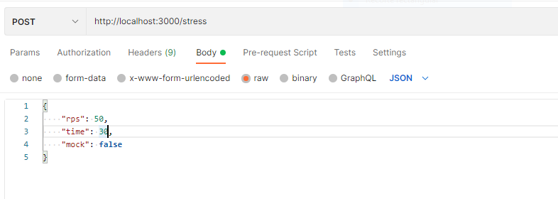
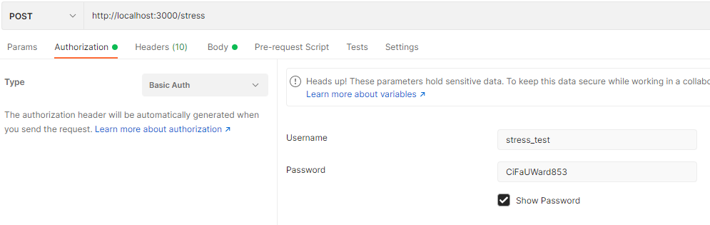
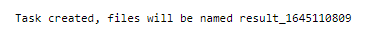
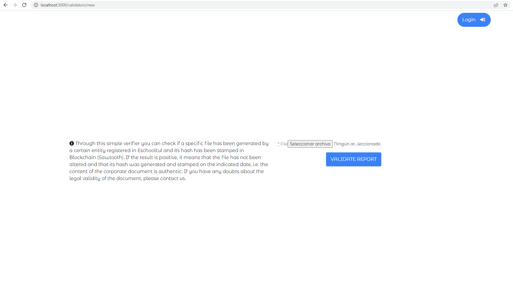
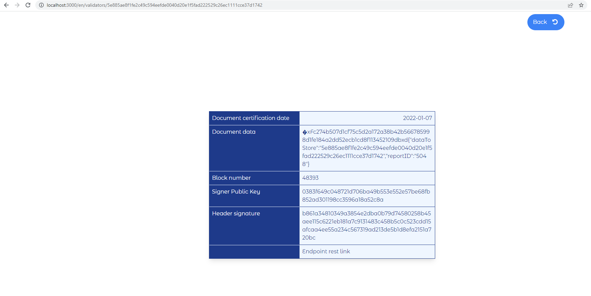

In order to stress the apiroom endpoint we have created two tasks: **generate** and **stress**. The former lets us create all required reports that will be used by the latter.


## Generate task

We were required to use data as real as possible so, first of all, we will need to generate and store it. Only reports ids and hashes are sent to the apiroom so we made a minimal generation of data such as user, school, courses, students, marks and reports. 

All the data we are generating is using Faker ([https://github.com/faker-ruby/faker](https://github.com/faker-ruby/faker)) and FactoryBot ([https://github.com/thoughtbot/factory_bot_rails](https://github.com/thoughtbot/factory_bot_rails)). 

While Faker is used to generating random/real data for each field of the models, FactoryBot is used to store them in the database.

The first thing the script does is to clear all the database related models so we can generate new ones (we assume we are in a testing environment)

We start by generating the school (required to generate a pdf). Then, the user is a director so all courses can be created and assigned to it.

The command accepts two arguments: courses and students. The former is the number of courses that will be created and the latter the number of students for each course. Each student will have one mark and one report with a pdf file. It accepts a **–help **argument to show the help message for each argument.

Here is an example of the command: 
```
rake generate:reports -- --courses 100 --students 25 
```


_It will clear and generate new data based on the args. When the command finishes, we will have 100 courses with 25 students each. Each student has 1 report so at the end there will be 100 * 25 = 2500 reports created ready to be used from the stress command._


## Stress task

This is the main task and is used to stress the apiroom endpoint. This task will generate two files, one is an HTML file and the other a JSON file. Both will have the same information. while the HTML will be used to display the data using a line chart, the JSON is just the raw data.

This task will perform concurrent POST requests to the apiroom endpoint in _ESTOOL_APIROOM_ENDPOINT_ environment variable. It will accept four arguments: file, rps, time and fake.


* **file**: the name of the output file in which the stress data will be stored (without extension). It will generate two files with this name but a different extension (HTML and JSON).
* **rps**: also known as requests per second. This will tell the task to perform N concurrent requests every second.
* **time**: the number of seconds to perform the stress
* **fake**: a boolean indicating whether to use fake data or reports from the database. If present, a random hash and id will be generated and used. If not present, reports from the database will be used and updated with the corresponding transaction_id.
* **help: **shows the help message for each argument.

Here is an example of the command: 
```
rake stress:apiroom -- --rps 50 --time 30 --file result_50rps_30time --fake
```

This will use fake data (random hash and id) due to the use of the **fake** argument. This example will perform the stress for 30 seconds and each second it will send 50 concurrent requests for a total of 50*30 = 1500 requests. After the stress test, metrics will be stored in **result_50rps_30time.html **and **result_50rps_30time.json** which can be accessed through the mounted folder in **_/var/lib/dokku/data/storage/eschooltul/results/_**.

Finally, as requested, we have created a controller with basic auth to launch this task.




Just change localhost and port to point to the machine. The controller will generate a pair of files called **result_&lt;timestamp> **by itself so no file param is needed.




The username and password is stored inside the credentials file in the project so you can change it to something else if needed.

Since the task may take a while to end, we are calling it inside a thread and returning with a 200 and a message similar to this one:




If the task ends successfully the files will be generated, otherwise, they won’t exist. If you need to check if the task completes or not it is better to use the command itself.


## Executing the command in the machine:

We have built the project inside Dokku ([https://dokku.com/](https://dokku.com/)) so in order to use the commands from the terminal we need to prepend **dokku run &lt;app>** to tell dokku to run the command inside the given app/container. In our case, it will be something like this: 


```
dokku run eschooltul rake generate:reports -- --help
```


This will display the help message for each command. The same applies to the stress command. 


## Validate report in the blockchain:

In order to validate if a report exists in the blockchain, we will need to get the pdf and upload it using this view:




This is a public route so no login is required. The endpoint is **_/validators/new_**.

If the report does exist in the blockchain it will redirect to this view:



As the data is generated with a command and Eschooltul only returns the pdf when the user submits a new mark via the web UI, we have created a new endpoint that requires the user to be logged in. This endpoint is accessed via the GET method and it will download the pdf file so we can use it in the validators route. The endpoint is as follows: **_/report_pdf/:id_** where **:id** is the ID of the report (we can get it by accessing the database). In order to use the endpoint, we need to be logged in as the user-generated from the task (it changes every time we call the generate command). For any user-created the password is **password**.

## Accessing the database

All the dataset generated is stored in a Dokku container with a Postgresql database. In order to connect to the database and do queries, we need to enter the container: 


```
dokku postgres:enter eschooltul_database
```


Once inside, connect to Postgresql: 


```
psql -U postgres. 
```


Then select the correct database: 


```
\c eschooltul_database. 
```


Now we can do queries to select the user or list reports to get the ID.


## Retrieving the result

Once the stress test finishes and result files are created we can download them into our computer to visualize the HTML or the JSON using **scp **command: 


```
scp -r root@195.201.41.85:/var/lib/dokku/data/storage/eschooltul/results path/in/our/computer
```

This command copies all files inside the results folder into a results folder on our computer.
